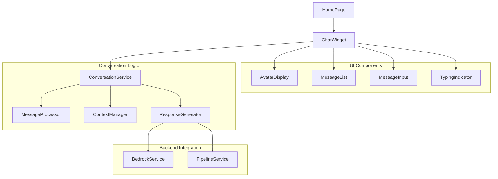
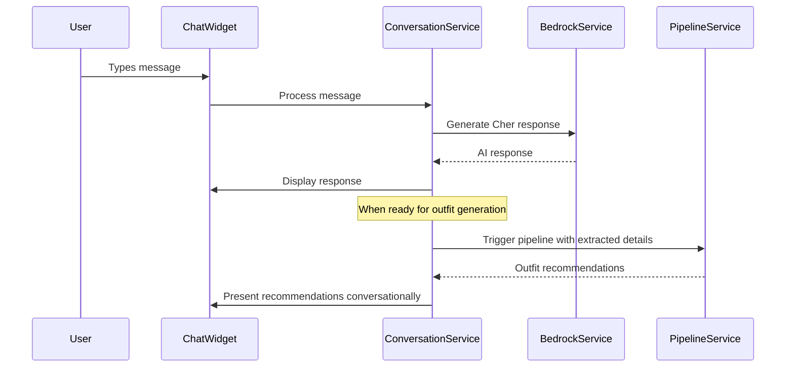
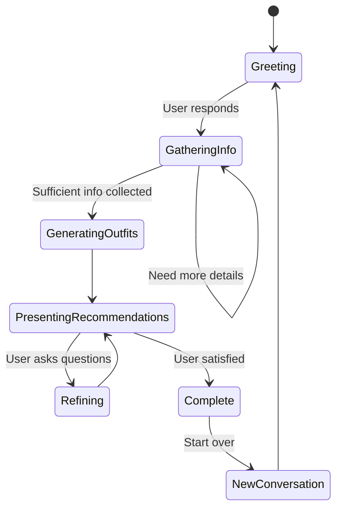

# Design Document

## Overview

The conversational chat widget creates an engaging, natural interface for users to interact with Cher, the AI outfit consultant. The design focuses on providing a seamless conversational experience that feels like talking to a knowledgeable personal stylist while leveraging the existing outfit generation pipeline and AWS Bedrock integration.

The widget replaces traditional form-based interactions with natural dialogue, making the outfit planning process more intuitive and enjoyable. Cher's personality and expertise shine through conversational responses that guide users through the outfit planning process organically.

## Architecture

### Component Architecture



### Integration with Existing System

The chat widget integrates seamlessly with the existing outfit generation pipeline:



### State Management

The conversation follows a natural flow with intelligent state transitions:



## Components and Interfaces

### 1. ChatWidget (Main Component)

**Purpose**: Orchestrates the entire chat experience and manages conversation state.

**Interface**:
```javascript
const ChatWidget = ({
    initialMessage,
    onOutfitGenerated,
    className,
    theme
}) => {
    // Component implementation
}
```

**Key Features**:
- Responsive design that works on mobile and desktop
- Smooth animations for message appearance
- Auto-scroll to latest messages
- Typing indicators and loading states
- Integration with existing HomePage layout

### 2. AvatarDisplay Component

**Purpose**: Provides visual representation of Cher with personality and engagement cues.

**Interface**:
```javascript
const AvatarDisplay = ({
    mood: 'greeting' | 'thinking' | 'excited' | 'helpful',
    isTyping: boolean,
    size: 'small' | 'medium' | 'large'
}) => {
    // Component implementation
}
```

**Features**:
- Animated avatar that reflects Cher's current state
- Subtle animations during thinking/typing
- Mood-based expressions
- Accessible design with proper alt text

### 3. MessageList Component

**Purpose**: Displays the conversation history with proper formatting and styling.

**Interface**:
```javascript
const MessageList = ({
    messages: Message[],
    isTyping: boolean,
    onMessageAction: (messageId, action) => void
}) => {
    // Component implementation
}
```

**Features**:
- Distinct styling for user vs Cher messages
- Support for rich content (outfit recommendations, images)
- Message timestamps and status indicators
- Smooth scroll animations

### 4. MessageInput Component

**Purpose**: Handles user input with smart features and validation.

**Interface**:
```javascript
const MessageInput = ({
    onSendMessage: (message) => void,
    disabled: boolean,
    placeholder: string,
    suggestions: string[]
}) => {
    // Component implementation
}
```

**Features**:
- Auto-resize text area
- Send button with loading states
- Keyboard shortcuts (Enter to send)
- Input validation and character limits
- Smart suggestions based on conversation context

### 5. ConversationService

**Purpose**: Manages conversation flow, context, and integration with AI services.

**Interface**:
```javascript
class ConversationService {
    async sendMessage(message, conversationId)
    async generateResponse(userMessage, context)
    getConversationHistory(conversationId)
    startNewConversation()
    extractEventDetails(conversationHistory)
    shouldTriggerOutfitGeneration(context)
}
```

**Responsibilities**:
- Message processing and routing
- Conversation context management
- Integration with Bedrock for AI responses
- Triggering outfit generation pipeline
- Session persistence

### 6. ContextManager

**Purpose**: Maintains conversation context and user preferences throughout the session.

**Interface**:
```javascript
class ContextManager {
    updateContext(key, value)
    getContext(key)
    extractEventDetails()
    hasRequiredInformation()
    getConversationSummary()
    clearContext()
}
```

**Context Data Structure**:
```javascript
{
    user: {
        name: string,
        preferences: {
            style: string[],
            budget: number,
            sizes: object
        }
    },
    currentEvent: {
        occasion: string,
        location: string,
        dates: string[],
        dressCode: string,
        specialRequirements: string[]
    },
    conversation: {
        stage: string,
        lastTopic: string,
        questionsAsked: string[],
        userResponses: object[]
    }
}
```

### 7. ResponseGenerator

**Purpose**: Creates contextually appropriate responses that maintain Cher's personality.

**Interface**:
```javascript
class ResponseGenerator {
    async generateCherResponse(userMessage, context)
    createGreeting(isReturningUser)
    askFollowUpQuestion(missingInfo)
    presentOutfitRecommendations(outfits, context)
    handleUserFeedback(feedback, recommendations)
}
```

**Cher's Personality Traits**:
- Knowledgeable but approachable
- Enthusiastic about fashion and styling
- Asks thoughtful follow-up questions
- Provides clear explanations for recommendations
- Remembers user preferences and references them

## Data Models

### Message

```javascript
{
    id: string,
    conversationId: string,
    sender: 'user' | 'cher',
    content: string,
    type: 'text' | 'outfit_recommendation' | 'question' | 'system',
    timestamp: Date,
    metadata: {
        mood?: string,
        attachments?: object[],
        actions?: string[]
    }
}
```

### Conversation

```javascript
{
    id: string,
    userId: string,
    startedAt: Date,
    lastActiveAt: Date,
    status: 'active' | 'completed' | 'abandoned',
    context: ConversationContext,
    messages: Message[],
    outfitRecommendations: OutfitRecommendation[]
}
```

### ConversationContext

```javascript
{
    stage: 'greeting' | 'gathering_info' | 'generating' | 'presenting' | 'refining',
    extractedDetails: {
        occasion: string,
        location: string,
        dates: string[],
        dressCode: string,
        budget: number,
        preferences: object
    },
    userProfile: {
        name: string,
        stylePreferences: string[],
        previousConversations: string[]
    },
    conversationFlow: {
        questionsAsked: string[],
        topicsCovered: string[],
        currentFocus: string
    }
}
```

## Error Handling

### Graceful Degradation

1. **AI Service Unavailable**: Fallback to predefined responses and manual form
2. **Network Issues**: Queue messages and retry when connection restored
3. **Context Loss**: Gracefully ask user to repeat key information
4. **Generation Failures**: Apologize and offer alternative approaches

### Error Recovery Strategies

```javascript
const errorHandling = {
    AI_UNAVAILABLE: {
        message: "I'm having trouble thinking right now. Let me try a different approach...",
        fallback: 'manual_form_mode'
    },
    NETWORK_ERROR: {
        message: "Looks like we lost connection. I'll remember what we discussed...",
        action: 'queue_and_retry'
    },
    CONTEXT_LOST: {
        message: "Sorry, I lost track of our conversation. Could you remind me about your event?",
        action: 'restart_gathering'
    }
};
```

## Testing Strategy

### Unit Testing

- **Component Testing**: Test each UI component with various props and states
- **Service Testing**: Mock AI responses and test conversation logic
- **Context Management**: Validate context updates and retrieval
- **Message Processing**: Test message formatting and validation

### Integration Testing

- **Conversation Flow**: Test complete user journeys through different scenarios
- **AI Integration**: Test Bedrock service integration with various inputs
- **Pipeline Integration**: Verify outfit generation triggering and results
- **Error Scenarios**: Test error handling and recovery paths

### User Experience Testing

- **Conversation Quality**: Evaluate naturalness and helpfulness of responses
- **Response Time**: Ensure responses feel immediate and engaging
- **Mobile Experience**: Test touch interactions and responsive design
- **Accessibility**: Verify screen reader compatibility and keyboard navigation

## Performance Considerations

### Optimization Strategies

1. **Response Caching**: Cache common responses and conversation patterns
2. **Lazy Loading**: Load conversation history progressively
3. **Debounced Input**: Prevent excessive API calls during typing
4. **Message Batching**: Group rapid messages for efficient processing

### Performance Metrics

- Response generation time (target: <2 seconds)
- Message rendering performance
- Memory usage for long conversations
- Network request optimization

## Security Considerations

### Data Protection

- Sanitize all user input before AI processing
- Encrypt conversation data in transit and at rest
- Implement rate limiting to prevent abuse
- Validate AI responses before displaying

### Privacy

- Clear conversation data after session ends
- Allow users to delete conversation history
- Anonymize data for analytics
- Respect user privacy preferences

## Integration Points

### Existing System Integration

1. **HomePage**: Replace static avatar with interactive ChatWidget
2. **BedrockService**: Extend with conversation-specific prompts
3. **PipelineService**: Trigger from conversation context
4. **Styling**: Integrate with existing design system

### New Dependencies

- Real-time messaging capabilities
- Conversation persistence (localStorage/sessionStorage)
- Enhanced AI prompting for personality
- Rich message formatting support

## Deployment Considerations

### Feature Rollout

- A/B testing between chat and traditional interfaces
- Gradual rollout with feature flags
- Fallback to existing form-based flow
- User feedback collection and iteration

### Monitoring

- Conversation completion rates
- User satisfaction metrics
- AI response quality tracking
- Performance monitoring and alerting

### Accessibility

- WCAG 2.1 AA compliance
- Screen reader optimization
- Keyboard navigation support
- High contrast mode compatibility
- Focus management for dynamic content