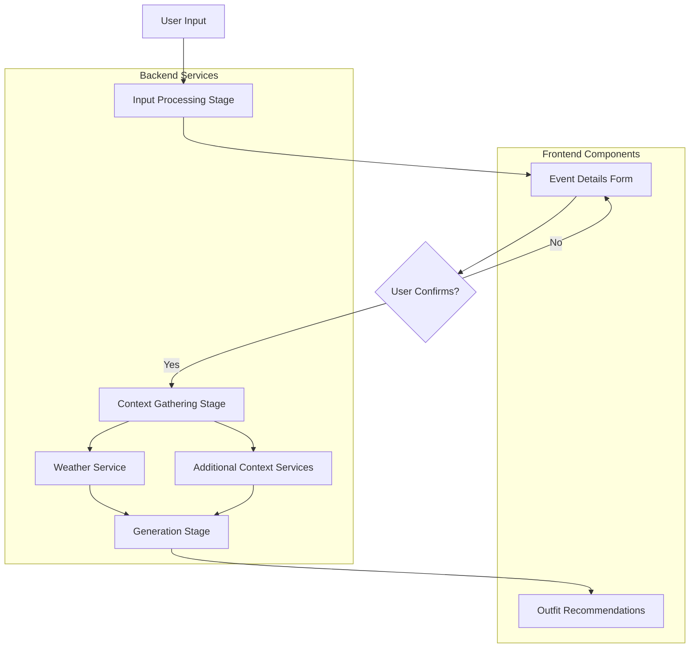
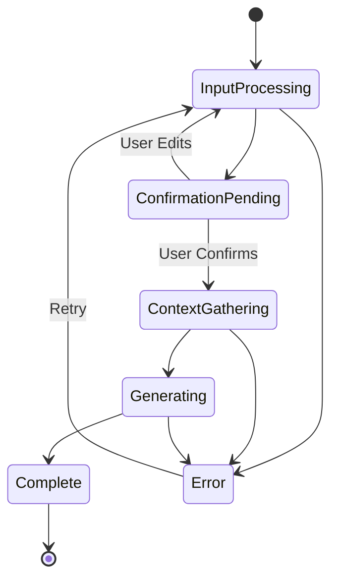

# Design Document

## Overview

The outfit generation pipeline implements a structured multi-stage workflow that transforms user input into high-quality outfit recommendations. The pipeline ensures proper data validation, context gathering, and user confirmation before generating recommendations, improving both user experience and recommendation quality.

The system follows a clear separation of concerns with distinct stages: input processing, confirmation, context gathering, and generation. Each stage has specific responsibilities and clear interfaces, making the system maintainable and extensible.

## Architecture

### Pipeline Flow Architecture



### Service Layer Architecture

The pipeline integrates with the existing service architecture:

- **ChatService**: Entry point for user messages, routes to pipeline
- **BedrockService**: AI processing for extraction and generation
- **WeatherService**: Weather data retrieval
- **PipelineService**: New orchestration service for stage management

### State Management

The pipeline uses a state machine approach with clear stage transitions:



## Components and Interfaces

### 1. PipelineService

**Purpose**: Orchestrates the entire pipeline workflow and manages stage transitions.

**Interface**:
```javascript
class PipelineService {
    async processUserInput(message, sessionId)
    async confirmEventDetails(eventDetails, sessionId)
    async generateOutfits(confirmedDetails, sessionId)
    getPipelineState(sessionId)
    resetPipeline(sessionId)
}
```

**Responsibilities**:
- Stage orchestration and state management
- Session management for multi-step workflows
- Error handling and recovery
- Integration with existing services

### 2. EventExtractionService

**Purpose**: Extracts structured event data from natural language input.

**Interface**:
```javascript
class EventExtractionService {
    async extractEventDetails(userMessage)
    validateEventDetails(eventDetails)
    identifyMissingInformation(eventDetails)
}
```

**Responsibilities**:
- Natural language processing for event details
- Data validation and normalization
- Missing information identification

### 3. Enhanced EventDetailsForm Component

**Purpose**: Displays extracted event details for user confirmation and editing.

**Interface**:
```javascript
const EventDetailsForm = ({
    eventData,
    onConfirm,
    onCancel,
    onEdit,
    loading,
    pipelineStage
}) => { ... }
```

**New Features**:
- Pipeline stage indicator
- Real-time validation feedback
- Smart defaults and suggestions
- Progressive disclosure for advanced options

### 4. ContextGatheringService

**Purpose**: Collects additional context data after user confirmation.

**Interface**:
```javascript
class ContextGatheringService {
    async gatherWeatherContext(location, dates)
    async gatherSeasonalContext(location, dates)
    async gatherCulturalContext(location, occasion)
    combineContextData(weatherData, seasonalData, culturalData)
}
```

**Responsibilities**:
- Weather data retrieval and processing
- Seasonal clothing recommendations
- Cultural and regional considerations
- Context data aggregation

### 5. Enhanced OutfitGenerator

**Purpose**: Generates outfit recommendations using confirmed details and gathered context.

**Interface**:
```javascript
class OutfitGenerator {
    async generateOutfits(eventDetails, contextData)
    optimizeForReuse(outfits, duration)
    generatePackingList(outfits)
    generateExplanations(outfits, constraints)
}
```

**Responsibilities**:
- AI-powered outfit generation
- Multi-day optimization
- Packing list creation
- Recommendation explanations

## Data Models

### PipelineState

```javascript
{
    sessionId: string,
    stage: 'input' | 'confirmation' | 'context_gathering' | 'generating' | 'complete' | 'error',
    eventDetails: EventDetails | null,
    contextData: ContextData | null,
    outfitRecommendations: OutfitRecommendation[] | null,
    error: Error | null,
    timestamp: string
}
```

### EventDetails

```javascript
{
    occasion: string,
    location: string | null,
    startDate: string | null,
    duration: number,
    dressCode: 'casual' | 'smart-casual' | 'business' | 'formal' | 'black-tie',
    budget: number | null,
    specialRequirements: string[],
    needsClarification: string[],
    extractedAt: string
}
```

### ContextData

```javascript
{
    weather: {
        forecast: WeatherForecast[],
        summary: string,
        clothingRecommendations: string[]
    },
    seasonal: {
        season: string,
        typicalClothing: string[],
        considerations: string[]
    },
    cultural: {
        region: string,
        dressNorms: string[],
        considerations: string[]
    },
    gatheredAt: string
}
```

### OutfitRecommendation

```javascript
{
    day: number,
    occasion: string,
    items: {
        [category: string]: ClothingItem
    },
    packingPriority: 'essential' | 'recommended' | 'optional',
    explanation: string,
    weatherConsiderations: string[],
    reuseOptimization: {
        sharedItems: string[],
        uniqueItems: string[]
    }
}
```

## Error Handling

### Error Types and Recovery

1. **Extraction Errors**: Fallback to manual form entry
2. **Weather Service Errors**: Continue with seasonal assumptions
3. **Generation Errors**: Retry with simplified parameters
4. **Network Errors**: Offline mode with cached data

### Error Recovery Strategy

```javascript
const errorRecoveryStrategies = {
    EXTRACTION_ERROR: 'fallback_to_manual_form',
    WEATHER_ERROR: 'use_seasonal_defaults',
    GENERATION_ERROR: 'retry_with_simplified_params',
    NETWORK_ERROR: 'enable_offline_mode'
};
```

## Testing Strategy

### Unit Testing

- **Service Layer**: Test each service independently with mocked dependencies
- **Component Layer**: Test UI components with various pipeline states
- **Data Models**: Validate data transformation and validation logic

### Integration Testing

- **Pipeline Flow**: Test complete user journeys through all stages
- **Service Integration**: Test interactions between services
- **Error Scenarios**: Test error handling and recovery paths

### End-to-End Testing

- **User Workflows**: Test complete user scenarios from input to recommendations
- **Cross-browser Compatibility**: Ensure consistent behavior across browsers
- **Performance Testing**: Validate response times for each pipeline stage

### Test Data Strategy

- **Mock Event Scenarios**: Various event types, locations, and durations
- **Weather Data Mocking**: Different weather conditions and forecast scenarios
- **Error Simulation**: Network failures, API errors, and invalid data

## Performance Considerations

### Optimization Strategies

1. **Parallel Processing**: Weather and context gathering in parallel
2. **Caching**: Cache weather data and common event patterns
3. **Progressive Loading**: Show partial results while processing
4. **Request Debouncing**: Prevent duplicate API calls during user edits

### Monitoring and Metrics

- Pipeline stage completion times
- Error rates by stage
- User abandonment points
- Cache hit rates

## Security Considerations

### Data Protection

- Sanitize user input before AI processing
- Encrypt session data in transit
- Implement rate limiting for API calls
- Validate all external API responses

### Privacy

- Minimize data retention
- Clear session data after completion
- Anonymize analytics data
- Respect user preferences for data usage

## Integration Points

### Existing System Integration

1. **ChatService**: Modified to route outfit requests to pipeline
2. **BedrockService**: Enhanced with pipeline-specific prompts
3. **WeatherService**: Integrated into context gathering stage
4. **UI Components**: EventDetailsForm enhanced for pipeline workflow

### External Dependencies

- OpenWeatherMap API for weather data
- AWS Bedrock for AI processing
- Browser localStorage for session management
- React state management for UI updates

## Deployment Considerations

### Feature Flags

- Enable/disable pipeline for gradual rollout
- A/B testing between old and new flows
- Emergency fallback to original system

### Monitoring

- Pipeline stage metrics
- Error tracking and alerting
- Performance monitoring
- User experience analytics